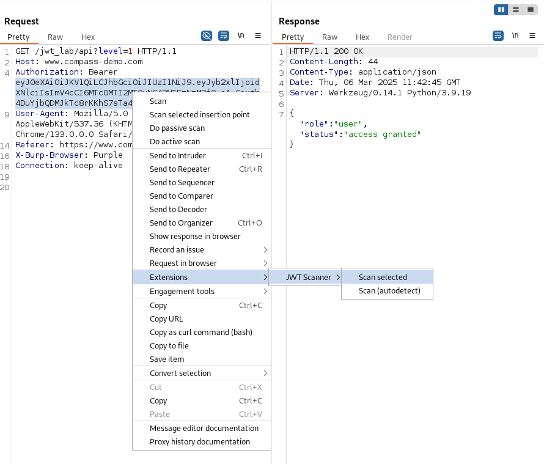

# JWT-scanner - Burp Extension

## Description
JWT Scanner is a Burp Suite extension designed for the automated testing of JSON Web Token (JWT) implementations in web applications.

## Features
- Automatically detects JWTs in the selected base request.
- Allows manual selection of the target JWT in the base request.
- Enables the selection of two base requests with different JWTs to attempt forging the public key.

### Checks
- Determines whether the algorithm is symmetric, asymmetric, or unknown. If symmetric, brute-forcing may be attempted.
- Checks if the JWT has an expiry. If it does not, an alert is generated. If it has expired, the scanner checks if
  it is still accepted; if so, an alert is generated. If not, an issue is raised since further checks may not work.
  It is advised not to select an already expired JWT. If the JWT has not yet expired, a future check will be scheduled
  to verify if the JWT is still accepted once the expiry is reached. If it is accepted, the appropriate alert will be
  displayed.
- Checks and alerts if the JWT is accepted without a signature.
- Checks and alerts if the JWT is accepted with an invalid signature.
- Checks and alerts if the JWT is accepted when signed symmetrically with an empty password.
- Checks and alerts if the JWT is accepted with variations of the "none" algorithm (e.g., none, NONE, NoNE, etc.).
- Checks and alerts if JWT verification is vulnerable to CVE-2022-21449.
- Checks and alerts if the JWT is accepted with an injected JWK header containing a self-generated public key.
- Checks and alerts if the server calls the URL in the JKU header (JKU pingback).
- Checks and alerts if the JWT is accepted with an injected JKU header pointing to a custom host that hosts a self-generated public key.
- Checks and alerts if the JWT is accepted when the KID header points to ../../../../../../../dev/null and the JWT is 
  signed with an empty password (KID path traversal).
- Checks for exposed public keys via the JKU header or well-known paths.
- Checks and alerts if the JWT is accepted when signed symmetrically with the exposed public key (algorithm confusion).
- Checks and alerts if the JWT is accepted when signed symmetrically with a forged public key (algorithm confusion).
- If any of the checks result in the server responding with a status code of 500 (Internal Server Error), an issue is created,
  as it may be worthwhile to investigate this further.

## Limitations
- Brute-forcing of symmetric keys is not implemented.
- KID path traversal is limited as it only attempts one path (../../../../../../../dev/null).
- Forging a public key requires the gmp native library (see https://gmplib.org). Compiled binaries are only supplied for the most
  common architectures via the JAR file (linux\_64, windows\_64, macos\_64, macos\_arm64).

## Benchmarks

### Compass Demo
```
https://www.compass-demo.com/jwt_lab/

Level 1:  PASS
Level 2:  PASS
Level 3:  PASS
Level 4:  FAIL  note: brute-forcing key not implemented
Level 5:  PASS
```

### Portswigger Labs
```
https://portswigger.net/web-security/all-labs#jwt

JWT authentication bypass via unverified signature:                     PASS
JWT authentication bypass via flawed signature verification:            PASS
JWT authentication bypass via weak signing key:                         FAIL  note: brute-forcing key not implemented
JWT authentication bypass via jwk header injection:                     PASS
JWT authentication bypass via jku header injection:                     FAIL  note: the lab does not resolve external URLs
JWT authentication bypass via kid header path traversal:                PASS
JWT authentication bypass via algorithm confusion:                      PASS
JWT authentication bypass via algorithm confusion with no exposed key:  PASS
```

### NeuronLegion brokencrystals
```
https://github.com/NeuraLegion/brokencrystals

Invalid Signature              PASS
KID SQL Injection              FAIL  note: sql-injection via kid header not implemented
Brute Forcing Weak Secret Key  FAIL  note: brute-forcing key not implemented
RSA to HMAC                    FAIL  note: jwk.json not in well-known path
X5U Rogue Key                  FAIL
X5C Rogue Key                  FAIL
JKU Rogue Key                  FAIL  note: bug?
JWK Rogue Key                  PASS
```

## Usage
Run an active scan or manually select a request from to check:

1. Go to  Proxy / Repeater / Target / Logger / Intruder
2. Select request that requires a authentication with a valid JWT and returns a HTTP 200 response

### Automatically detect JWT
1. Right-click on the request you want to check.
2. Extension -> JWT Scanner -> Scan (autodetect)
3. In case of a identified vulnerability a issue is generated

Autodetect JWT from valid request:


### Manually select JWT
1. Highlight the target JWT in request
2. Right-click highlighted JWT request
3. Extension -> JWT Scanner -> Scan selected
4. In case of a identified vulnerability a issue is generated

Manually select JWT from valid request:



### Forging public keys

If a public key is not exposed, you can try forge one.

1. Select two base requests each containing exactly one but different JWT
2. Right-click highlighted JWT requests
3. Extension -> JWT Scanner -> Forge public key
4. Investigate Event and Issue log
5. If successful rerun "Scan (autodetect)" or "Scan selected"


## Installation
1. Download the latest pre-built jar file from [releases](https://github.com/CompassSecurity/jwt-scanner/releases).
2. Extension -> Installed -> Add -> Extension Details -> Extension Type: *Java* -> Select file ...
3. Select the downloaded jar

## Build
Using gradle to build jar:
```shell
./gradlew jar
```
